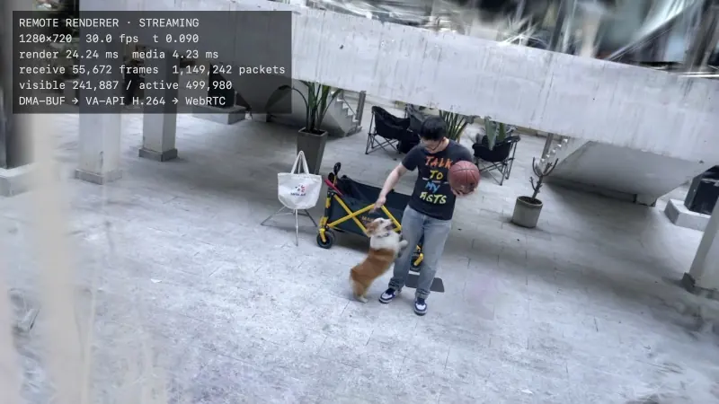
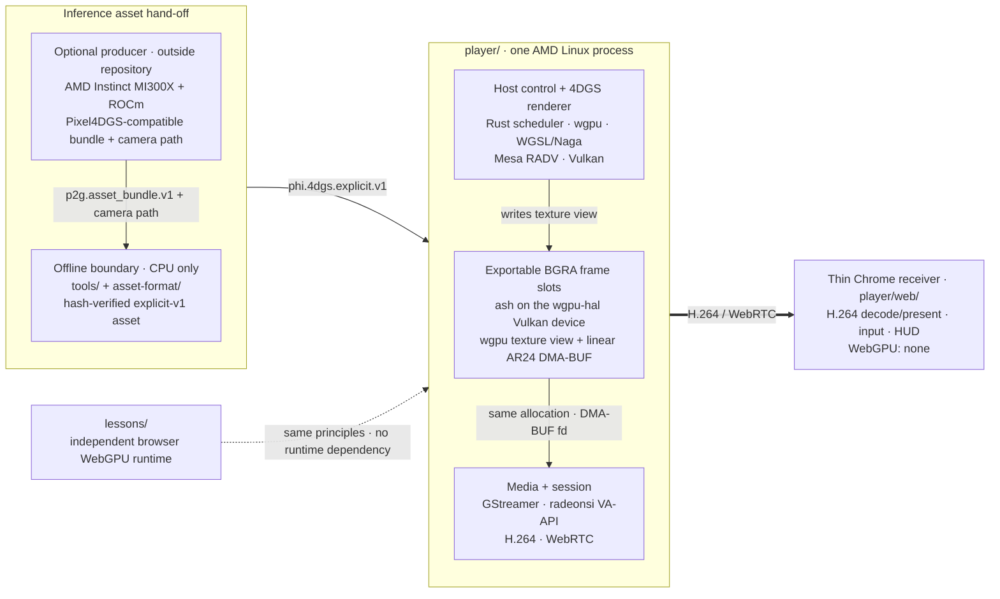
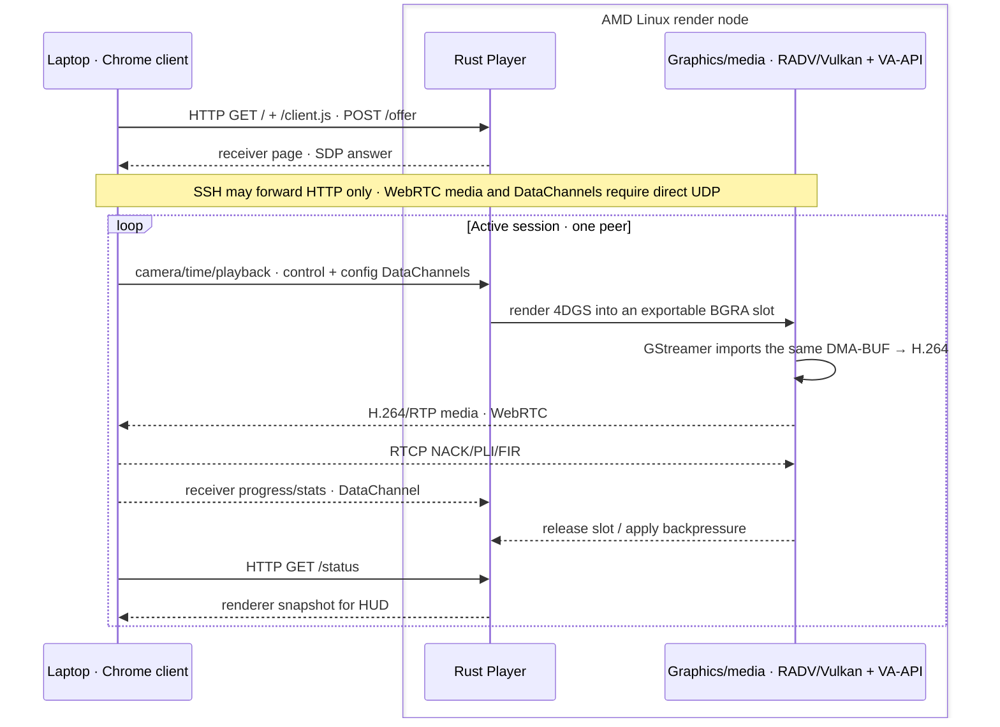

# 4DGS Viewer Phi

[简体中文](README.zh-CN.md)

4DGS Viewer Phi is an architecture-first, verifiable reference for remotely
rendered, interactive 4D Gaussian scenes. Phi Media Lab develops it for an
AMD-based pipeline spanning upstream ROCm compute and downstream Radeon/Linux
graphics and media.

The reference workflow separates two AMD hardware roles: AMD Instinct MI300X
with ROCm can produce inference assets upstream through the sister
[Pixel4DGS reconstruction project](https://github.com/phi-media-lab/4dgs-reconstruction-Phi),
while an AMD Radeon Linux node owns interactive rendering and media encoding.
A laptop browser remains a thin receiver. This repository publishes the
inference/serving side and the strict asset boundary between the two; it does
not publish a training system. Producer-side settings and hand-off commands are
documented in the
[Pixel4DGS Viewer interoperability guide](https://github.com/phi-media-lab/4dgs-reconstruction-Phi/blob/main/docs/VIEWER_INTEROP.md).



*Corgi — 499,980 SH3 Gaussians rendered by the AMD Linux reference Player while
camera pose and normalized time change together. The authentic runtime HUD is
preserved. Only this rendered preview is distributed; the source video and
Gaussian asset are not. See
[`THIRD_PARTY.md`](THIRD_PARTY.md#selfcap-corgi-renderer-preview).*

## Architecture at a glance

### Software components



The solid path is the serving path; the dotted link is conceptual reuse only.
Each BGRA slot is one Vulkan allocation exposed as both a wgpu texture and a
DMA-BUF descriptor, not a post-render copy through `ash`.

### Server–client service model



The Linux process owns the GPU device, Gaussian resources, command order, frame
slots, cadence and encoder. The browser owns H.264 presentation and user input.
Gaussian payloads never cross the network in Remote Frame Mode.

This keeps client bandwidth and decode cost tied to the encoded video profile,
not to the number of Gaussians. The tradeoff is per-session render/encode cost
on the AMD node and dependence on network latency; v0.1 is deliberately
single-peer.

## AMD hardware and software ecosystem

The reference design uses compute, graphics and media capabilities from the
AMD hardware and software ecosystem as separate system roles rather than
forcing training and interactive delivery into one runtime.

| Stage | Reference hardware/software | Responsibility |
| --- | --- | --- |
| Upstream asset production | AMD Instinct MI300X + ROCm | Train or prepare a [Pixel4DGS](https://github.com/phi-media-lab/4dgs-reconstruction-Phi)-compatible inference bundle; outside this repository |
| Interactive rasterization | AMD Radeon GPU + Linux `amdgpu`/DRM + Mesa RADV | Execute the Vulkan 4DGS workload |
| Portable GPU layer | Rust + wgpu + WGSL/Naga | Describe resources, shaders, passes and submission |
| Vulkan escape hatch | `ash` + `wgpu-hal` | Create an exportable Vulkan image and wrap the same image as a wgpu texture |
| Graphics/media contract | Vulkan external memory + linear DRM AR24 + DMA-BUF | Share a rendered frame without a full-frame CPU pixel copy |
| Media path | Mesa radeonsi VA-API + GStreamer 1.24 | Import BGRA, convert to NV12, encode H.264 and packetize WebRTC |
| Receiver | Chrome/Chromium on a laptop | Decode and present video; return camera and time controls |

Most of the renderer remains in portable wgpu/WGSL. The narrow
`ash`/`wgpu-hal` boundary exists because an exportable Vulkan image and its
DMA-BUF file descriptor must be controlled explicitly.

The public Player runtime does **not** depend on ROCm, HIP or AMF. ROCm belongs
to the optional upstream asset-production workflow; the deployed renderer uses
Vulkan/RADV and VA-API/radeonsi. Vulkan, DMA-BUF, VA-API, GStreamer and WebRTC
are not AMD-private interfaces, but AMD/Mesa is the only renderer integration
for which this project currently makes a support claim.

## 4DGS GPU frame graph

```text
explicit-v1 geometry + motion + SH0/SH3
        │
        ├─ validate records and evaluate time activation
        ├─ project covariance, cull and compact the active set
        ├─ build depth keys and perform four-pass radix sorting
        ├─ audit equal-depth cases and build indirect work
        ├─ bin ordered Gaussians into tiles
        ├─ composite front-to-back with explicit termination policy
        └─ resolve composited color into the exportable BGRA frame slot
```

Camera and time changes enter the same server-owned frame graph. The browser
therefore observes spatial parallax and temporal deformation together without
holding a second copy of the scene representation.

## Design invariants

- **One device owner.** The Linux renderer owns device and resource lifetime;
  the browser never creates a Gaussian-rendering `GPUDevice`.
- **Explicit interop.** Streaming accepts only a single-plane linear AR24
  modifier verified across RADV and radeonsi. A tiled-only or CPU-copy fallback
  is rejected.
- **Precisely scoped copying claim.** The Vulkan render target is not staged
  through full-frame CPU pixel memory before VA-API. GPU color conversion,
  encoded bitstreams, network transport and browser decode still exist;
  one-frame validation intentionally performs readback.
- **Training/rendering decoupling.** A versioned, hash-closed inference asset is
  the boundary. Training checkpoints, optimizers and datasets are not runtime
  dependencies.
- **Falsifiable evidence.** Asset conformance, shader/render parity, media color
  correctness and browser interaction are independent validation gates.

## What ships

| Component | Purpose | Execution surface |
| --- | --- | --- |
| [`player/`](player/) | Native Remote Frame renderer and thin WebRTC receiver | AMD Linux reference renderer + Chrome |
| [`asset-format/`](asset-format/) | Versioned explicit 4DGS manifest and binary contract | Runtime-neutral |
| [`tools/convert_p2g_asset.py`](tools/convert_p2g_asset.py) | Deterministic Pixel4DGS inference-asset bridge | Offline, CPU-only |
| [`evidence/`](evidence/) | Hash-bound native reference and comparison receipts | Validation |
| [`lessons/`](lessons/) | Seven first-principles WebGPU/WGSL experiments | Browser WebGPU |

The lessons expose projection, ordering, temporal evaluation and GPU command
structure in editable source. They are a companion explanation of the rendering
principles, not the frontend of the native Player and not an AMD benchmark.

## Validated envelope

The renderer reference profile is Ubuntu 24.04 x86_64 with an AMD GPU exposed
through Mesa RADV Vulkan, linear DMA-BUF accepted by radeonsi VA-API, and
GStreamer 1.24. The receiver target is a current H.264-capable Chrome/Chromium.

The current server is single-peer and LAN-oriented. HTTP signaling may be
forwarded over SSH, while WebRTC media and controls require a directly reachable
UDP path. TURN, public signaling, authentication, multi-tenancy and production
scheduling are not implemented. Other renderer GPUs and Linux combinations are
unverified; macOS is receiver-only and Windows is out of scope.

Portable CI, AMD hardware execution and an interactive Chrome session prove
different things. The project does not treat a source build as proof of
Vulkan/VA-API interoperability, or one rendered frame as proof of network
behavior. See [`docs/VALIDATION.md`](docs/VALIDATION.md).

## Start with the architecture

| Question | Document |
| --- | --- |
| Who owns data, commands and transport? | [`docs/ARCHITECTURE.md`](docs/ARCHITECTURE.md) |
| How is the AMD reference Player built and run? | [`player/README.md`](player/README.md) |
| What hardware/software profile is supported? | [`docs/SUPPORTED_PLATFORMS.md`](docs/SUPPORTED_PLATFORMS.md) |
| How does an inference asset enter the system? | [`docs/P2G_ASSET_BRIDGE.md`](docs/P2G_ASSET_BRIDGE.md) |
| How are claims verified independently? | [`docs/VALIDATION.md`](docs/VALIDATION.md) |
| How can the GPU stages be studied interactively? | [`lessons/README.md`](lessons/README.md) |
