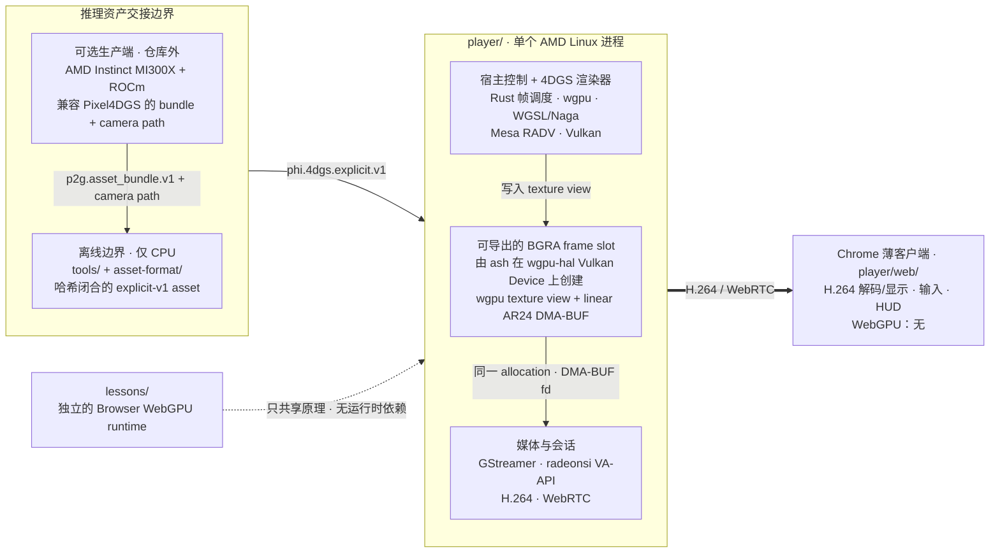
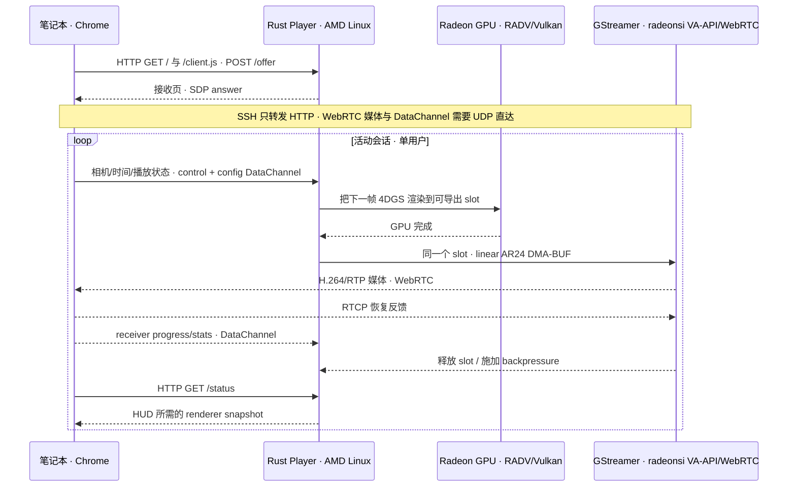

# 4DGS Viewer Phi

[English](README.md)

4DGS Viewer Phi 是一个架构优先、可验证、面向远端交互式 4D Gaussian 场景
的参考实现，由 Phi Media Lab 与 AMD 合作推进。

参考工作流把两类 AMD 硬件职责解耦：上游可以使用 AMD Instinct MI300X 和
ROCm 生产推理资产，AMD Radeon Linux 节点负责交互式渲染与媒体编码，笔记本
浏览器保持为薄客户端。本仓库公开推理/服务部分以及连接两者的严格资产边界，
不公开训练系统。


*Corgi——499,980 个 SH3 Gaussian；由 AMD Linux 参考 Player 渲染，相机位姿
与归一化时间同时变化，并保留真实运行时 HUD。本仓库仅分发这段渲染预览，
不分发源视频或 Gaussian asset；权利边界见
[`THIRD_PARTY.md`](THIRD_PARTY.md#selfcap-corgi-renderer-preview)。*

## 架构总览

### 软件组件



实线是服务主链，虚线只表示概念复用。每个 BGRA slot 都是同一块 Vulkan
allocation，同时暴露为 wgpu texture 和 DMA-BUF descriptor，并不是渲染完成后
再通过 `ash` 复制一次。

### Server–Client 服务模式



Linux 进程拥有 GPU Device、Gaussian 资源、命令顺序、frame slot、帧节奏和
编码器；浏览器只拥有 H.264 显示和用户输入。在 Remote Frame Mode 下，
Gaussian payload 不经过网络。

因此，客户端带宽和解码成本由编码视频配置决定，而不是由 Gaussian 数量决定。
代价是 AMD 节点需要为每个会话承担渲染和编码成本，并受到网络时延约束；v0.1
有意限定为单用户。

## AMD 软硬件参考设计

这项合作把 AMD 的计算、图形与媒体能力划分为不同系统职责，而不是把训练和
交互式交付强行耦合到一个运行时中。

| 阶段 | 参考软硬件 | 在本项目中的职责 |
| --- | --- | --- |
| 上游资产生产 | AMD Instinct MI300X + ROCm | 训练或准备兼容 Pixel4DGS 的推理 bundle；不在本仓库内 |
| 交互式光栅化 | AMD Radeon GPU + Linux `amdgpu`/DRM + Mesa RADV | 执行 Vulkan 4DGS workload |
| 可移植 GPU 层 | Rust + wgpu + WGSL/Naga | 描述资源、Shader、pass 与命令提交 |
| Vulkan escape hatch | `ash` + `wgpu-hal` | 创建可导出的 Vulkan image，并把同一 image 包装为 wgpu texture |
| 图形/媒体合同 | Vulkan external memory + linear DRM AR24 + DMA-BUF | 在不进行全帧 CPU 像素拷贝的条件下共享已渲染帧 |
| 媒体链路 | Mesa radeonsi VA-API + GStreamer 1.24 | 导入 BGRA、转换 NV12、编码 H.264 并封装 WebRTC |
| 接收端 | 笔记本上的 Chrome/Chromium | 解码显示视频，返回相机和时间控制 |

渲染器的大部分代码保持在可移植的 wgpu/WGSL 抽象内。狭窄的
`ash`/`wgpu-hal` 边界用于显式控制可导出的 Vulkan image 及其 DMA-BUF
文件描述符。

公开 Player 的运行时**不依赖** ROCm、HIP 或 AMF。ROCm 属于可选的上游资产
生产工作流；部署后的渲染器使用 Vulkan/RADV 和 VA-API/radeonsi。Vulkan、
DMA-BUF、VA-API、GStreamer 和 WebRTC 都不是 AMD 私有接口，但 AMD/Mesa
是本项目当前唯一提出支持声明的渲染端组合。

## 4DGS GPU frame graph

```text
explicit-v1 geometry + motion + SH0/SH3
        │
        ├─ 验证记录并计算时间激活状态
        ├─ 投影协方差、剔除并压缩 active set
        ├─ 构建深度 key，执行四轮 radix sort
        ├─ 审计 equal-depth 情况并构建 indirect work
        ├─ 把有序 Gaussian 分配到 tile
        ├─ 按从前到后顺序合成，执行显式终止策略
        └─ 把合成颜色 resolve 到可导出的 BGRA frame slot
```

相机和时间变化进入同一个服务端 frame graph。因此，浏览器可以同时观察空间
视差和时间形变，而不需要持有第二份场景表示。

## 设计不变量

- **唯一 Device owner。** Linux 渲染器拥有 Device 和资源生命周期；浏览器
  不创建用于 Gaussian 渲染的 `GPUDevice`。
- **显式互操作。** 串流仅接受已经在 RADV/radeonsi 之间验证的单平面 linear
  AR24 modifier；只有 tiled layout 或需要 CPU copy 时会显式失败。
- **精确限定拷贝声明。** Vulkan render target 进入 VA-API 前不经过全帧 CPU
  像素内存；GPU 色彩转换、编码 bitstream、网络传输和浏览器解码依然存在，
  单帧验证也会有意执行 readback。
- **训练/渲染解耦。** 版本化、哈希闭合的推理资产是两者边界；训练 checkpoint、
  optimizer 和 dataset 不是运行时依赖。
- **可证伪证据。** 资产一致性、Shader/渲染一致性、媒体颜色正确性和浏览器交互
  是相互独立的验证门。

## 仓库产物

| 组件 | 用途 | 执行位置 |
| --- | --- | --- |
| [`player/`](player/) | Native Remote Frame 渲染器与轻量 WebRTC 接收端 | AMD Linux 参考渲染端 + Chrome |
| [`asset-format/`](asset-format/) | 版本化 explicit 4DGS manifest 与二进制合同 | 与运行时无关 |
| [`tools/convert_p2g_asset.py`](tools/convert_p2g_asset.py) | 确定性的 Pixel4DGS 推理资产 bridge | 离线、仅 CPU |
| [`evidence/`](evidence/) | 哈希绑定的 native reference/comparison receipt | 验证流程 |
| [`lessons/`](lessons/) | 七个第一性原理 WebGPU/WGSL 实验 | 浏览器 WebGPU |

课程以可编辑源码展示投影、排序、时间求值和 GPU 命令结构。它是渲染原理的配套
解释，不是 Native Player 的前端，也不是 AMD 性能 benchmark。

## 已验证边界

参考渲染端是 Ubuntu 24.04 x86_64：AMD GPU 通过 Mesa RADV Vulkan 暴露，
linear DMA-BUF 可由 radeonsi VA-API 接受，并使用 GStreamer 1.24。接收端目标
是当前支持 H.264 的 Chrome/Chromium。

当前服务面向单用户和可达局域网。HTTP 信令可以通过 SSH 转发；WebRTC 媒体与
控制需要 UDP 直达。TURN、公开信令、认证、多租户和生产级调度尚未实现。其他
渲染端 GPU 和 Linux 组合尚未验证；macOS 仅作为接收端，Windows 不在范围内。

可移植 CI、AMD 硬件执行和 Chrome 交互会证明不同的事情。本项目不会把源码
编译通过当作 Vulkan/VA-API 互操作证据，也不会把单帧正确当作网络行为证据。
验证模型见 [`docs/VALIDATION.md`](docs/VALIDATION.md)。

## 从架构开始

| 问题 | 文档 |
| --- | --- |
| 数据、命令和传输分别由谁拥有？ | [`docs/ARCHITECTURE.md`](docs/ARCHITECTURE.md) |
| 如何构建并运行 AMD 参考 Player？ | [`player/README.md`](player/README.md) |
| 支持哪些软硬件配置？ | [`docs/SUPPORTED_PLATFORMS.md`](docs/SUPPORTED_PLATFORMS.md) |
| 推理资产如何进入系统？ | [`docs/P2G_ASSET_BRIDGE.md`](docs/P2G_ASSET_BRIDGE.md) |
| 各项声明如何独立验证？ | [`docs/VALIDATION.md`](docs/VALIDATION.md) |
| 如何交互式理解 GPU 阶段？ | [`lessons/README.md`](lessons/README.md) |
